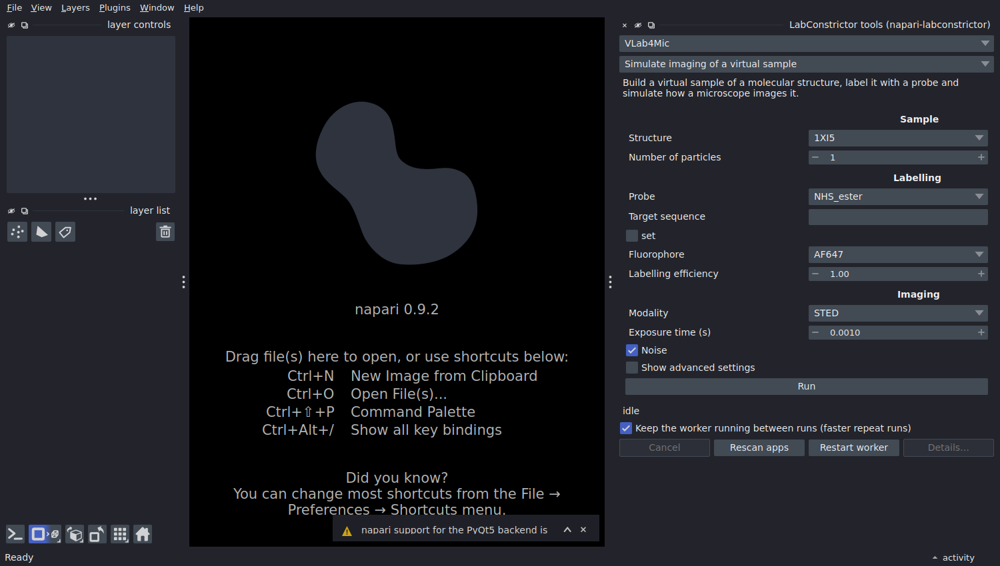
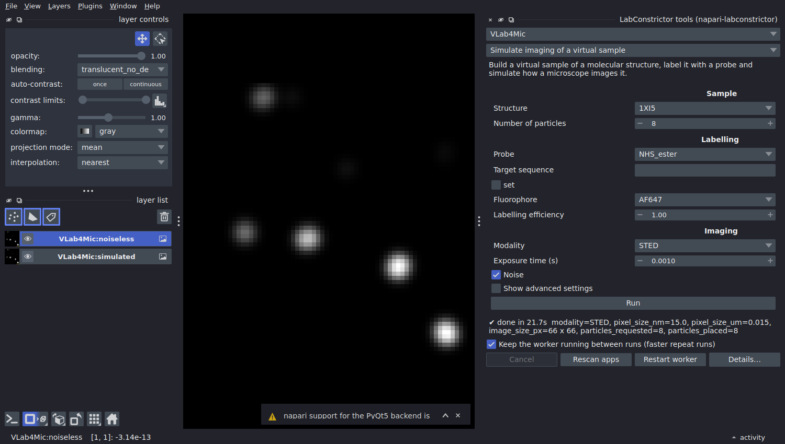
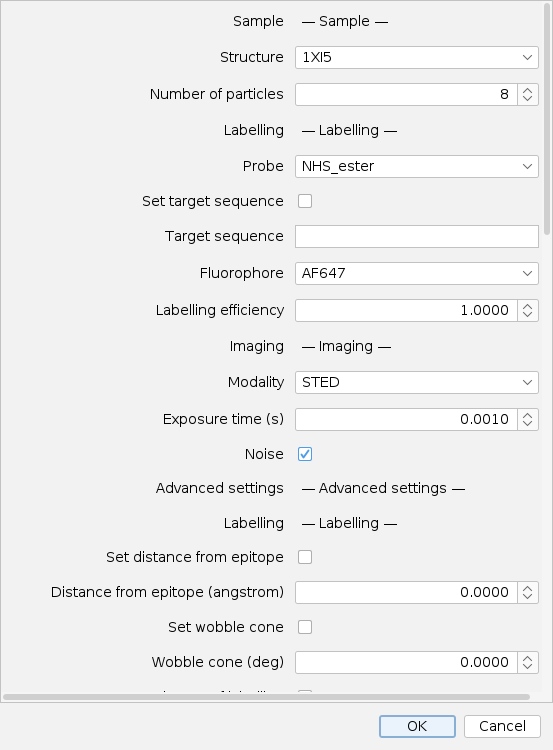
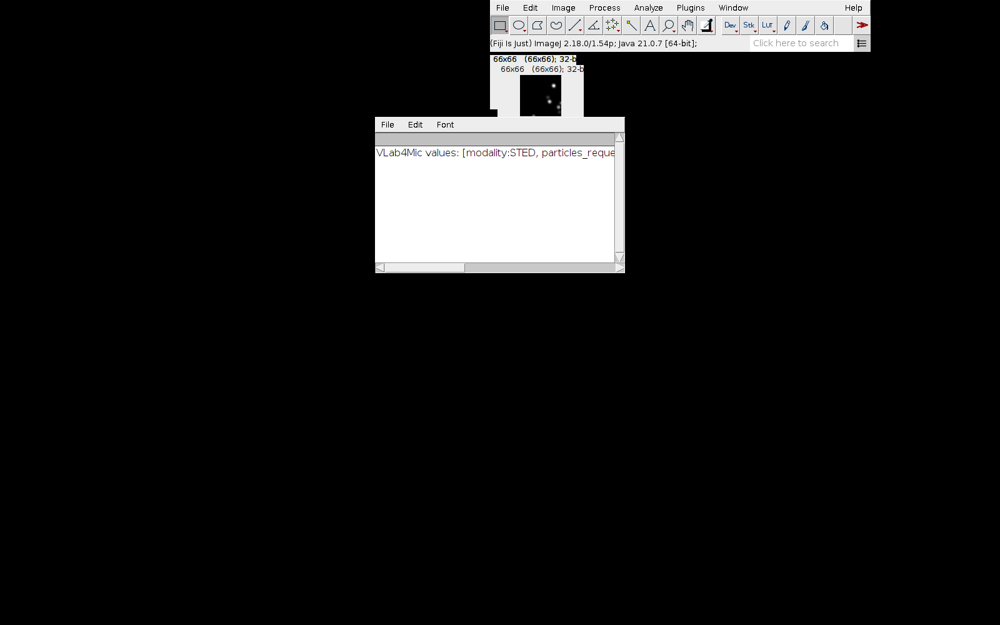

<div align="center">


# VLab4Mic Desktop App

**Download and install VLab4Mic on your computer. A friendly toolkit to simulate fluorescence microscopy images, no coding required.**

[VLab4Mic website](https://vlab4mic.henriqueslab.org/) · [Main project repository](https://github.com/HenriquesLab/VLab4Mic) · [Releases](https://github.com/HenriquesLab/LabConstrictor-VLab4Mic/releases)

</div>

---

## What is VLab4Mic?

VLab4Mic is a virtual laboratory that lets you explore, test, and design imaging experiments before stepping into the microscope room. You build virtual samples from molecular structures, apply fluorescent labelling, and simulate image acquisition across microscopy modalities, all without writing code. It works equally well for newcomers learning the basics and for experienced researchers benchmarking probes, PSFs, or reconstruction methods.

With VLab4Mic you can:

- Build virtual samples from PDB/CIF structures
- Apply direct or indirect fluorescent labelling
- Add structural variation and molecular crowding
- Simulate image acquisition across multiple modalities
- Run parameter sweeps to explore experimental conditions
- Compare noiseless versus realistic acquisitions

## What this repository gives you

This repository is the desktop-app distribution of VLab4Mic, built with [LabConstrictor](https://github.com/CellMigrationLab/LabConstrictor). It provides one-click installers for **Windows, macOS, and Linux**, so you can run VLab4Mic locally with no Python setup. The installers are published on the [Releases page](https://github.com/HenriquesLab/LabConstrictor-VLab4Mic/releases).

## Download and install

Full step-by-step instructions for each operating system are in the [installation guide](.tools/docs/download_executable.md).

| Platform | Installer | Notes |
|----------|-----------|-------|
| Windows | `.exe` | Double-click to install. Approve via `More info` then `Run anyway` if Windows warns. |
| macOS | `.pkg` (ARM64 or Intel) or `.sh` | Pick ARM64 for Apple silicon, Intel otherwise. |
| Linux | `.sh` | Run `bash VLab4Mic-<version>-Linux-x86_64.sh`, or mark executable and run. |

Installation takes around 6 to 8 minutes and is only needed once. After installing, launch VLab4Mic from your desktop, Start Menu, or Applications folder.

## How-to: install and run your first simulation

### 1. Install the app (about 10 minutes, once)
1. Open the [Releases page](https://github.com/CellMigrationLab/LabConstrictor-VLab4Mic/releases) and download the installer for your system from the newest release: the `.exe` for Windows, the `.pkg` for a Mac with an Apple chip (M1 or newer; Intel Macs are not supported), the `.sh` for Linux.
2. Run it and follow the prompts (choose *Install only for me*). It downloads and sets up Python and VLab4Mic, which takes 6 to 8 minutes; the window may look idle for a while.
3. Windows: if it warns that the publisher is unknown, click **More info**, then **Run anyway**. macOS: if it refuses to open, go to **System Settings > Privacy & Security**, scroll to *Security* and click **Open Anyway**. Step-by-step pictures: [installation guide](.tools/docs/download_executable.md).

You now have the VLab4Mic notebook app. To use it from Napari or Fiji, continue below; the app must stay installed, because the two programs only show its tools.

### 2. First simulation in Napari
1. Install the two small Napari add-ons into the Python environment where Napari lives, then restart Napari ([details](https://github.com/CellMigrationLab/napari-labconstrictor#install)):
   ```
   pip install https://github.com/CellMigrationLab/LabConstrictor-Tools/archive/refs/heads/main.zip
   pip install https://github.com/CellMigrationLab/napari-labconstrictor/archive/refs/heads/main.zip
   ```
2. In Napari open **Plugins > LabConstrictor tools**. Pick **VLab4Mic**, then **Simulate imaging of a virtual sample**. The form is the same as the notebook's: structure, labelling, imaging. The advanced settings are behind *Show advanced settings*; the form scrolls.

   

3. Choose a modality (here STED, 8 particles) and press **Run**. The first run downloads the structure and can take a minute; later runs of the same structure take 10 to 60 seconds. The line under the form tells you the result and the pixel size.

   

4. You get two layers, `VLab4Mic:simulated` and `VLab4Mic:noiseless`. Every new run **replaces** them. To keep a result, rename its layer: a renamed layer is never replaced.

### 3. First simulation in Fiji
1. Copy `labconstrictor-fiji-*.jar` into `Fiji.app/plugins/` and restart Fiji ([details](https://github.com/CellMigrationLab/LabConstrictor-Fiji#install)).
2. Choose **Plugins > LabConstrictor > LabConstrictor Tools...**, pick **VLab4Mic** and **Simulate imaging of a virtual sample**. The dialog has the same settings, grouped as in the notebook.

   

3. Press **OK**. The simulated image opens in its own window, with the settings summary in a text window (the Log). Running again replaces the window; rename it to keep it.

   

### Common problems
| What you see | What to do |
|---|---|
| The installer window looks stuck | Wait: the installation takes 6 to 8 minutes. |
| Napari or Fiji lists no VLab4Mic | The app is not registered: install it (or reinstall), then press **Rescan apps** in Napari or restart Fiji. |
| The first run is very slow | It downloads the structure; the next run is faster. Keep **Keep the worker running** ticked in Napari. |
| The image is only 10 x 10 pixels | Widefield pixels are 100 nm and the default field is 1000 nm: raise *Sample size XY* under advanced settings. |
| A run fails | Press **Details...** (Napari) or read the Log window (Fiji); the last lines say why. Press **Restart worker** and try again. |
| Something else | [Open an issue](https://github.com/CellMigrationLab/LabConstrictor-VLab4Mic/issues) with a screenshot and the text of **Details...**. |

## Use VLab4Mic from Napari and Fiji (experimental)

The installer also registers two VLab4Mic tools for the [LabConstrictor tools bridge](https://github.com/CellMigrationLab/LabConstrictor-Tools), so that [Napari](https://github.com/CellMigrationLab/napari-labconstrictor) and [Fiji](https://github.com/CellMigrationLab/LabConstrictor-Fiji) show them as forms, and so that the command line can run them:

| Tool | What it does |
|---|---|
| **Simulate imaging of a virtual sample** | Builds a virtual sample of a structure (clathrin, nuclear pore, HIV capsid, T4 capsid), labels it with a probe and images it with one of the five modalities, with the settings of the notebook (advanced ones are folded away). Returns the simulated and the noiseless image, plus the pixel size. |
| **Compare an image with a reference** | Measures the structural similarity (SSIM) and the Pearson correlation of two images after matching their pixel sizes. |

Example from a terminal (use the Python of the installed app):

```
<install folder>/bin/python -m labconstrictor_tools run VLab4Mic simulate_sample modality=STED random_seed=1
<install folder>/bin/python -m labconstrictor_tools run VLab4Mic simulate_sample structure=7R5K probe=NPC_Nup96_Cterminal_direct modality=Widefield sample_size_xy_nm=3000
```

Good to know:
- The first run with a structure downloads it, and a run takes from about 10 seconds (small structure, STED) to over a minute (nuclear pore, SMLM). Stopping a run takes effect between its stages.
- The image covers a square field (1000 nm by default, *Sample size XY* under advanced settings). A widefield image at 100 nm per pixel has only 10 x 10 pixels in the default field: use a larger field for the coarser modalities.
- The pixel size is reported in the results (Napari and Fiji do not read it from the image): enter it as the pixel size of the layer or window when you compare images.
- Each simulation replaces the previous `simulated` and `noiseless` images (one layer or window, not a pile while you tune the settings). To keep a result for comparison, rename its layer (Napari) or window (Fiji): a renamed one is never replaced.
- SSIM is high for sparse images even when they do not match (an image full of background looks alike); read it together with the Pearson correlation.
- The form uses the same controls as the notebook: sliders for the number of particles, the labelling efficiency, the wobble cone (0 = none) and the structural integrity (1 = intact), dropdowns for the structure, probe, fluorophore and modality. You can image your own structure file (`.cif` or `.pdb`, instead of the PDB ID) and set the orientation angles as comma-separated lists, as in the notebook.
- Not in the tools (use the notebook): probes made from a protein, residue or primary probe, new fluorophores, image-based placement of particles, several modalities or probes in one run, parameter sweeps, and multi-frame acquisitions (a single frame is returned).
- The notebooks are unchanged.

Developers: `src/vlab4mic_lc_tools` holds the declarations, `lc_tests/` the tests (see `lc_tests/README.md`).

## Other ways to use VLab4Mic

Prefer not to install anything, or want full scripting control? The [main VLab4Mic repository](https://github.com/HenriquesLab/VLab4Mic) covers the alternatives:

- **Google Colab** notebooks, no installation needed
- **Local Jupyter notebooks** with the same widget interface
- **Python library** for scripting and automation

## Documentation and support

- Website and tutorials: https://vlab4mic.henriqueslab.org/
- Main project repository: https://github.com/HenriquesLab/VLab4Mic
- Questions and bug reports: [open an issue](https://github.com/HenriquesLab/LabConstrictor-VLab4Mic/issues)

## Citation

If you use VLab4Mic in your research, please cite:

```bibtex
@article{martinez_2026_vlab4mic,
  title={VLab4Mic: prediction of structural resolvability in super-resolution microscopy},
  author={Mart{\'i}nez, Dami{\'a}n and Saraiva, Bruno M. and Shakespeare, Tayla and
          Bates, Mark and Owen, Dylan M. and Leterrier, Christophe and
          Del Rosario, Mario and Henriques, Ricardo},
  year={2026},
  journal={bioRxiv},
  doi={10.64898/2026.06.02.729521},
  url={https://www.biorxiv.org/content/10.64898/2026.06.02.729521v1}
}
```

## License

Released under the [MIT License](LICENSE).

## 🔄 Automatic Template Updates

LabConstrictor can prepare pull requests that keep this repository aligned with improvements in the main template, including updates to GitHub Actions workflows. Complete the one-time [automatic synchronization setup](.tools/docs/template_synchronization.md) to enable these updates.
